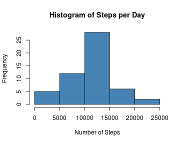
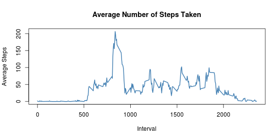
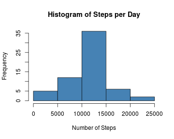

# Personal Activity 

## Introduction 

The data being analysed was collected from a personal activity monitoring device (eg. fitbit, fuelband, ...).  It details the number of steps taken by the person wearing the device, for 5 minute intervals through out the day, and this for a period of 2 months. 

The variables included in the dataset are:

- **steps**: number of steps taking in a 5-minute interval (missing values are coded as NA)
- **date**: the date on which the measurement was taken in YYYY-MM-DD format
- **interval**: identifier for the 5-minute interval in which measurement was taken


## How to generate this report 

Change to the project directory: 

    $ cd [path-to-project]/RepData_PeerAssessment1

Unzip the data file: 

    $ unzip activity.zip

Startup R and kick off knitr: 

    $ R 
    > library(knitr)
    > knit2html('PA1_template.Rmd') 
    > browseURL('PA1_template.html')

The last command above should open the generated html file `PA1_template.html` in your favourite browser.


## Loading and preprocessing the data

Load the data into a dataframe named 'act', name the columns.


```r
act<-read.table( "activity.csv", sep=",", as.is=T, header=T,na.strings="NA")
names(act)<- c("steps","date","interval")
```

The dimensions of the dataframe:


```r
dim(act)
```

```
## [1] 17568     3
```


Sample data: 


```r
kable(act[16777:16797,], row.names=F)
```


| steps|date       | interval|
|-----:|:----------|--------:|
|   280|2012-11-28 |      600|
|   731|2012-11-28 |      605|
|   733|2012-11-28 |      610|
|   721|2012-11-28 |      615|
|   713|2012-11-28 |      620|
|   731|2012-11-28 |      625|
|   721|2012-11-28 |      630|
|   358|2012-11-28 |      635|
|   574|2012-11-28 |      640|
|   569|2012-11-28 |      645|
|    20|2012-11-28 |      650|
|    28|2012-11-28 |      655|
|     0|2012-11-28 |      700|
|    69|2012-11-28 |      705|
|    53|2012-11-28 |      710|
|    60|2012-11-28 |      715|
|    17|2012-11-28 |      720|
|    59|2012-11-28 |      725|
|    45|2012-11-28 |      730|
|   123|2012-11-28 |      735|
|     0|2012-11-28 |      740|


## What is mean total number of steps taken per day?

*Assignment*: make a histogram of the total number of steps taken each day, and report the mean and median total number of steps taken per day. Ignore the missing values in the dataset. 


*Solution*: do the aggregation of steps per day, which we store in the dataframe 'sum_by_day'. The default behaviour of the `aggregate()` function is to ignore NA's. 

Preparation:

```r
sum_by_day  <- aggregate( act[,"steps"] ,by=list(day=act[,"date"]),sum)
```

Calculate the mean and median: 

```r
day_mean    <- mean(sum_by_day$x,na.rm=T)
day_median  <- median(sum_by_day$x,na.rm=T)
```

Create the plot: 


```r
hist(sum_by_day$x, col='steel blue', 
     xlab="Number of Steps", 
     main="Histogram of Steps per Day")
```

 

The number of daily taken steps has a **mean** of **10766** and a **median** of **10765**.


## What is the average daily activity pattern?

*Assignment*: make a time series plot of the 5 minute interval and the average number of steps taken averaged across all days. Which interval contains the maximum number of steps? 

*Solution*: for the `plot()` function to work correctly, we explicitly need to filter out the NA records. To that purpose we build a vector `valid_steps` containing a reference to the valid records (ie. the ones that do not have NA for *steps*), and then do the aggregation of steps per interval, which we store in the dataframe `mean_by_interval`.


```r
valid_steps <- which(!is.na(act$steps))

mean_by_interval = aggregate( act[valid_steps,"steps"] ,by=list(interval=act[valid_steps,"interval"]),mean)

plot( mean_by_interval$interval, mean_by_interval$x, 
      type="l", lwd=2, col="steel blue", 
      xlab="Interval", ylab="Average Steps", main="Average Number of Steps Taken")
```

 


Calculate the maximum:

```r
# interval with maximum steps
max_steps          <- max(mean_by_interval$x)
max_steps_interval <- mean_by_interval[mean_by_interval$x==max_steps,"interval"]
```

The maximum number of steps, 206, was taken in **interval 835**.


## Imputing missing values

*Assignment*: calculate/report the total number of missing values in the dataset. Device a strategy for filling in the missing values. Create a new dataset with the missing values filled in. Similar to the first part, make a histogram, and report the meand and median, and any differences with the first part of this assignment. What is the impact of missing data?

*Solution*

#### How many invalid rows?

To identify the valid records we re-use the vector `valid_steps`, see above, and compare its length to the number of rows in the `act` dataframe.


```r
num_invalid <- nrow(act)-length(valid_steps)
pct_invalid <- round(100*num_invalid/nrow(act),0)
```
The **number of rows with missing values** totals **2304** or 13% of the rows. 

#### Strategy to fill in the missing values 

The choosen strategy for filling the missing values: 

- take the mean for each interval that does have data 
- enter the data into the corresponding intervals with 'missing value'

#### Create a new, filled-in dataset

The new dataset with the missing data filled in is called `act_fill`, and is created as follows:


```r
# Make a copy of the original dataframe
act_fill<-act

# calculate the mean for every interval, over all the days, but only for the valid records
interval_mean= aggregate( act[valid_steps,"steps"] ,by=list(interval=act[valid_steps,"interval"]),mean)

# for every interval, fill in the blanks
for (i in 1:nrow(interval_mean)) { 
    k<-interval_mean[i,"interval"]      # lookup key: the interval identifier
    v<-round(interval_mean[i,"x"],0)    # the corresponding value
    act_fill[act_fill$interval==k & is.na(act_fill$steps),"steps"]<-v
}
```


#### Histogram and conclusions

Plot the histogram: 


```r
# aggregate the steps per day
sum_by_day  <- aggregate( act_fill[,"steps"] ,by=list(day=act_fill[,"date"]),sum)

hist(sum_by_day$x, col='steel blue', 
    xlab="Number of Steps", main="Histogram of Steps per Day")
```

 

Calculate the mean and median: 

```r
# absolute difference
day_mean_fill   <- mean(sum_by_day$x,na.rm=T)
day_median_fill <- median(sum_by_day$x,na.rm=T)

# percentage difference
pct_diff_mean   <- 100*(day_mean-day_mean_fill)/day_mean
pct_diff_median <- 100*(day_median-day_median_fill)/day_median
```

The number of daily taken steps has a **mean** of **10765.64** and a **median** of **10762**.

The difference of the meand and median statistics of `act` and `act_fill` is only 0.01% and 0% respectively. 

Conclusion regarding difference with first part: 

- There is nearly no difference between the  values for mean and median, compared to the same statistics computed in the first part.
- It is safe to conclude that the impact of imputing missing data on the estimates is neglible.  


## Are there differences in activity patterns between weekdays and weekends?

*Assignment*: in the filled-in dataset, create a new factor variable indicating whether the date is a weekday or a weekend day. Make a two-panel plot of the 5-minute interval and average number of steps taken, averaged across weekdays or weekend days. 

*Solution* 

In `act_fill` create a new column `day_type` of type factor, and assign it a weekday or weekend depending on the date.


```r
# assign 'weekday' to all day types
act_fill[,"day_type"]="weekday"

# assign 'weekend' to Saturdays and Sunday's 
act_fill[ weekdays(strptime(act_fill$date,"%Y-%m-%d"),abbreviate=T) %in% c("Sun","Sat"),"day_type"]="weekend"

# turn it into a factor
act_fill[,"day_type"]=as.factor(act_fill[,"day_type"])

# store the aggregate in the to-be-plotted dataframe 
tbp = aggregate( act_fill[,"steps"] ,by=list(interval=act_fill[,"interval"], day_type=act_fill[,"day_type"]),mean)
```

Plot 


```r
par( mfrow=c(2,1) )
par( mar=c(1.1,4.1,1.1,4.1))
par( oma=c(4.1,0,4.1,0))


plot( tbp[ tbp$day_type=="weekend","interval" ], tbp[tbp$day_type=="weekend","x"], 
      type="l", lwd=2, col="medium sea green",
      ylab="Weekend", xlab="" )
abline(h=0,v=600)
abline(h=0,v=1200)
abline(h=0,v=1800)

title( main = "Weekday vs Weekend Activity Patterns",outer=T)


plot( tbp[ tbp$day_type=="weekday","interval" ], tbp[tbp$day_type=="weekday","x"], 
      type="l", lwd=2, col="pale violet red",
      ylab="Weekday", xlab="Interval")
abline(h=0,v=600)
abline(h=0,v=1200)
abline(h=0,v=1800)
```

 

The vertical lines indicate the times: 6h00, 12h00 and 18h00, to make it easier to pinpoint morning/afternoon/evening on the chart.

**Conclusion:**

- on weekdays and weekend days, there is a burst of activity before 10am. 
- after that it levels off and stays within a limited band, on weekdays, but for weekend days there is a markedly higher level of activity in the afternoon.

